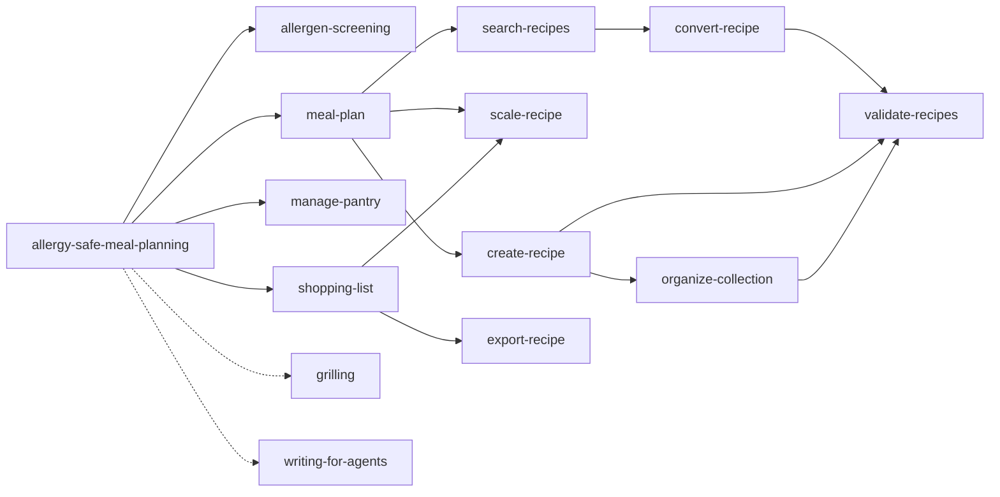

# Agent skills are packages. Where is the package manager?

## Content

*Editorial outline — remove before publishing.*

| § | Section | Purpose |
|---|---|---|
| 1 | Hook | Format + eval matured; provisioning did not. |
| 2 | The signal | 2026 direction: skills as versioned packages. |
| 3 | A skill is a package | The six supply-chain parts tools reinvent. |
| 4 | Two graphs, two resolvers | Dependency (CLI) vs context (LLM). |
| 5 | The shape of a skill | The two resources, concretely. |
| 6 | Capabilities are needs | Need + probe; the environment owns the rest. |
| 7 | Why evaluation cannot rely on an informal supply chain | Three reproducibility questions. |
| 8 | A lock you can verify | Content-addressable Merkle lock. |
| 9 | Managing the graph | deps/caps/lineage + linking. |
| 10 | A small probe | The graph and the frictions. |
| 11 | What to standardize | The minimal spec. |
| 12 | Close | One line. |

**Throughline:** eval raced ahead → it grades an artifact it cannot uniquely name →
provisioning is the missing supply-chain layer → here is the shape it should take.

**Meta:** tags `ai`, `opensource`, `agents`, `devtools`. One concrete repo as the probe;
2026 papers as timing, not a reading list. CTA: "what would you pin first?"

---

Two things matured in agent skills this year. The format (`SKILL.md`) and the
evaluation. The layer between them — provisioning — is still ad hoc, and that is
starting to hurt.

Evaluation is moving fastest. NVIDIA's **AEVAL** (arXiv:2607.16345, July 2026) replaces
"watch a demo and form an impression" with a deterministic, change-triggered CI pipeline:
every skill ships an `eval.config` contract, each change runs install → execute → grade,
and a structurally separate grader stops the executor from grading its own
self-corrections.

But look at what AEVAL has to *assume*: it "installs the modified skill into a clean
session." There is no standard that says what that install is.

## The signal

This is not one paper's idea. In 2026 the whole field moved the same way: evaluation as a
deterministic pipeline, skills as versioned artefacts, quality as a lifecycle property.
AEVAL, "From Registry to Repository", MCRI, SkillSpec — different lenses, one direction:
treat a skill as a **named, versioned package**.

The tooling just hasn't caught up. That gap is provisioning.

## A skill is a package. Treat it like one.

A skill is natural language plus code: a `SKILL.md`, scripts, config, and dependencies on
other skills. That is a package. Packages have package managers for a reason — the parts
the ecosystem is currently reinventing, per tool:

- **Identity.** A name and a version. Not a branch head. The version is the handle for
  regression: copy it, update it, diff it.
- **Dependencies.** Skills depending on skills, cycles rejected, orphans caught.
- **Resolution.** Pin to an exact commit or content hash. A skill is a prompt injected
  into a privileged agent, so an unpinned dependency is a supply-chain risk.
- **A lockfile.** Deterministic, sorted, integrity-hashed, byte-identical across machines.
- **Provisioning.** Install the same graph into every agent runtime, reproducibly.
- **Provenance.** Who published it, and evidence it wasn't tampered with.

## Two graphs, two resolvers

A skill participates in **two graphs**, and conflating them is the ecosystem's core
confusion:

- **Dependency graph** — what the package manager resolves. Lives in `manifest.json`.
  Resolved by the **CLI**, pinned in the lock, reproducible. The agent never sees it.
- **Context graph** — what the agent loads into its window. Declared in `SKILL.md`
  frontmatter as **bare names**. Resolved by the **LLM** at runtime: it reads a name and
  decides whether to pull that skill in.

Different resources, different resolvers, and they must not cross: the CLI never reads
frontmatter for resolution; the LLM never reads the manifest. A build/install order and a
token-budget decision are not the same relation — one is about bytes on disk, the other
about what enters the window. Lint is the integrity check between them.

## The shape of a skill

Two files, two jobs.

`manifest.json` — the package (CLI-resolved):

```jsonc
{
  "name": "shopping-list",
  "version": "0.1.0",
  "source": "file:skills/shopping-list",            // where THIS skill comes from
  "dependencies": [
    { "name": "scale-recipe", "type": "skill", "path": "skills/scale-recipe", "version": "0.1.0" },
    { "name": "grilling", "type": "skill",
      "repo": "github.com/mattpocock/skills",
      "path": "skills/productivity/grilling",
      "ref": "4dd886b0…", "integrity": "sha256:4dd886b0…" }
  ],
  "capabilities": [ { "name": "cookcli", "probe": "cook --version" } ]
}
```

`SKILL.md` frontmatter — the context (LLM-resolved):

```yaml
---
name: shopping-list
description: Turn chosen recipes into one consolidated shopping list.
metadata:
  version: 0.1.0
  dependencies: [scale-recipe, export-recipe, grilling, teach, to-questionnaire, wait-what, writing-for-agents]
  capabilities: [cookcli]
  references: [references/format.md]
---
```

Rules that make the split work: `dependencies` are **skills only**; tools are
**capabilities**; `references` are context; the version lives in both and must mirror.
`source` records where *this* skill came from — `file:` locally, `git:<repo>@<ref>` when
published.

## Capabilities are needs, not implementations

A capability is a declaration, not a plugin. The skill says what it needs and, optionally,
how to check it. The environment decides how to provide and invoke it — an MCP server, a
binary, a Python or Rust script, an HTTP API. `cookcli` is `probe: "cook --version"`;
`allergy_guard` is host-provided (no probe → delegated). That sidesteps modeling every
runtime: one declaration, environment-owned resolution.

## Why evaluation cannot rely on an informal supply chain

Deterministic evaluation promises: same skill → comparable signal. That quietly depends on
answering, for any run:

1. Which exact bytes of the skill executed?
2. Which versions of its dependencies resolved?
3. Can I reproduce that install tomorrow, on another runtime?

If any answer is "whatever was at HEAD," the signal isn't reproducible, versions aren't
comparable, and a regression can't be attributed. AEVAL's own failure modes —
self-correction bias, protocol drift — are evaluated against a skill artifact that needs a
stable identity first.

So: **package management is the substrate evaluation sits on.**

## A lock you can verify

`skills lock` resolves the dependency graph, hashes each skill's content, and writes a
**Merkle** lock: a node's hash folds its version, its content, and its dependencies'
hashes. A reference is a locator plus a digest:

```
skills/scale-recipe@sha256:6e470856…
git+github.com/mattpocock/skills@4dd886b0…#grilling@sha256:4dd886b0…
```

Change one skill and its hash, every dependent's hash, and the root `graphHash` move.
`skills verify --frozen` fails closed: `0` ok, `2` drift, `3` missing lock, `1` graph
error. That is the artifact evaluation can name.

## Managing the graph

You don't hand-edit two files. `skills deps add|rm|list|sync` and `skills caps add|rm`
edit **both resources** in one step, reject cycles (restoring the files on failure), and
re-lock. `skills lineage <a> <b>` prints an edge-typed path:

```
allergy-safe-meal-planning -[skill]-> meal-plan -[skill]-> create-recipe -[skill]-> validate-recipes
allergy-safe-meal-planning -[remote: github.com/mattpocock/skills@95da47fc97af]-> writing-for-agents
```

with `--all`, `--reverse`, `--json`. The graph is programmable, not decorative.

Provisioning follows the same idea: `skills add` / `skills sync` symlink local skills into
the canonical `.agents/skills`, so every agent has **one entry point** while `skills/`
stays the source of truth.

## A small probe

I built a deliberately small system to feel the friction: a voice meal planner whose
behaviour lives in a graph of skills, served by open-weight models. The interesting part
was not the agent. It was making the graph *provisionable*.

- Each skill declares bare dependency names in `SKILL.md`; its `manifest.json` resolves
  *where* each comes from. Capabilities are needs with probes.
- Third-party skills are vendored (MIT) so the graph resolves offline; remote deps are
  pinned by ref.
- The `skills` CLI is pinned and patched with a reviewable series: `validate`, `lint`,
  `sync-deps`, `lock` / `verify`, `graph` / `lineage` / `impact`, `deps` / `caps`.
- The lock is content-addressable; the agent store is symlinked; the version is mirrored.

The resolved graph: 12 local skills, the 5 pinned authoring skills they all depend on, and
the runtime closure (every skill also depends on the 5 remotes — dashed):



Every step forced a decision the ecosystem hasn't standardized: where the version lives;
a lint surface that must be **pluggable** (skills ship shell, Python, JS — so checks are
hooks, pre-commit style, not a monolith); and — for shipping this at all — that Bun allows
**one patch per `package@version`**, so a multi-change patch became a reviewable **series**
applied by a hook.

## What to standardize

A minimal, boring supply-chain spec for skills:

- A versioned manifest with **skills-only** dependencies and a lockfile with content hashes.
- **Package references**: `path` locally, `repo` + `ref` remotely, plus a `source` for the
  skill itself.
- **Content-addressable references** (`<locator>@sha256:<hash>`), so a change anywhere
  propagates and the lock verifies itself.
- **Two graphs in two resources** — manifest (CLI) and `SKILL.md` (LLM) — with lint as the
  conformance check between them.
- A manifest even with **zero dependencies**: it carries the version, and `SKILL.md`
  mirrors it. Version identity is what turns "the skill changed" into "this skill
  regressed."
- **Capabilities as a need + an optional probe**, not an implementation.
- A lint surface that is pluggable, and one canonical linked location per agent.

Get that right and evaluation stops grading "the skill, as far as we can tell" and starts
grading a named, pinned, reproducible artifact — the only kind a statistical gate can
consume.

The eval wave is arriving. It will need something to stand on.

---

*AEVAL: arXiv:2607.16345 — "From Anecdotal to Deterministic Testing for Agentic Skill
Workflows" (NVIDIA, University of Waterloo).*
